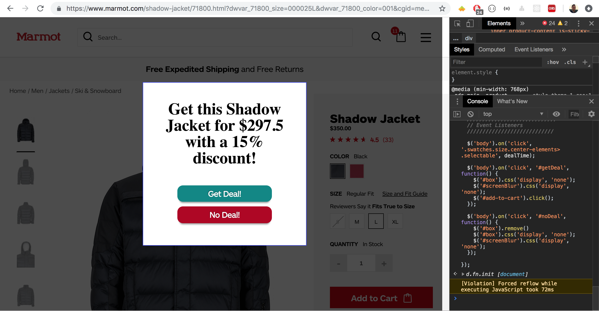

# Discount-Pop-up
#### By Ian Knepper
## Logic to that triggers a pop-up to inform users of deals &amp; coupons

Purpose: Using the website marmot.com, write some JavaScript or jQuery code that can be run in the console of the browser on any product page.<br>

## The code should do the following:<br>

* Create a trigger that activates an overlay when the user clicks any size option.
* The overlay should be centered on top of the site and display the information gathered above along with two buttons - one button should close the overlay and the other should take the user to the cart page. The text in
* the overlay should read: <br>
"Get this {product name} for {discounted price} with a 15% discount"

* Behind the overlay add a semi­-transparent black background that obscures the site.
* The overlay should be able to trigger multiple times if dismissed.

### To run Discount Pop-up in your browser:
```
`Copy & paste the code from Ian Knepper- Interactive Front End- Challenge-2.js
```
`paste into the console of your browser in inspect mode.
```
`Hit enter.
```
`Click on any available size for a product.
```


## Stack
* jQuery that runs in console
* CSS

## My Work


## Authors

* **Ian Knepper** - *Initial work* - (https://github.com/rollaflip )
